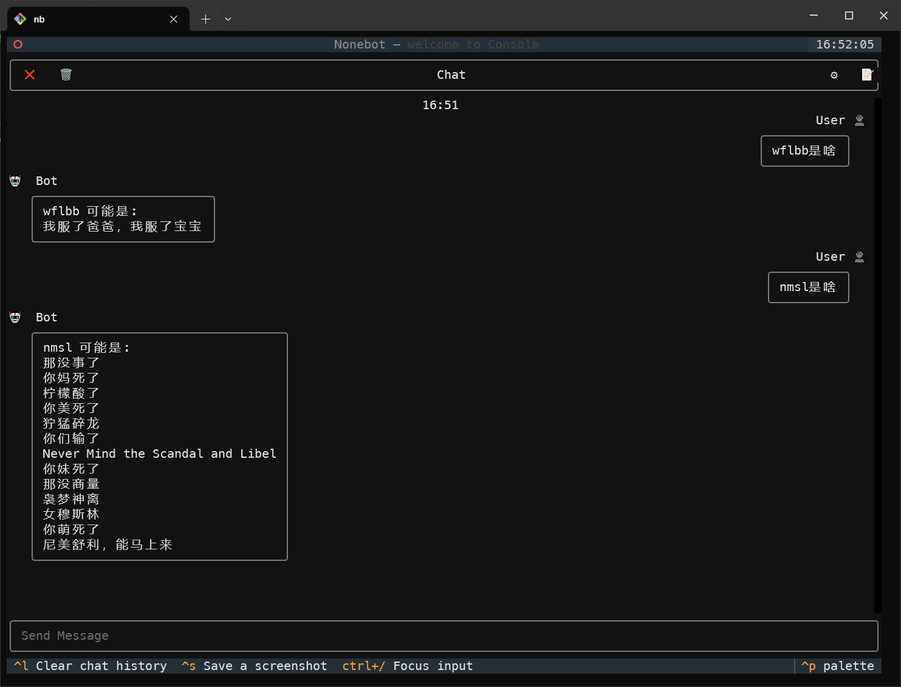

  
   
  

# [ Deprecated ] 🦄 nonebot-plugin-nbnhhsh-q
此项目已不再维护，这个项目只是满足了一下自己的好奇心，用AI辅助写的，我不会维护这个项目了！

_✨ 这是一个nonebot2机器人框架的插件，用于提供缩写中文的翻译，调用了 【 [神奇海螺 - 能不能好好说话](https://github.com/itorr/nbnhhsh) 】 的api ✨_

## 📖 介绍

**能不能好好说话?**

基于 神奇海螺api 的缩写翻译 nonebot2 插件

## 💿 安装

使用 nb-cli 安装

在 nonebot2 项目的根目录下打开命令行, 输入以下指令即可安装

    nb plugin install nonebot-plugin-nbnhhsh-q

使用包管理器安装

在 nonebot2 项目的插件目录下, 打开命令行, 根据你使用的包管理器, 输入相应的安装命令

pip

    pip install nonebot-plugin-nbnhhsh-q

pdm

    pdm add nonebot-plugin-nbnhhsh-q

poetry

    poetry add nonebot-plugin-nbnhhsh-q

conda

    conda install nonebot-plugin-nbnhhsh-q

打开 nonebot2 项目根目录下的 `pyproject.toml` 文件, 在 `[tool.nonebot]` 部分追加写入

    plugins = ["nonebot_plugin_nbnhhsh_q"]

## ⚙️ 配置

开箱即用！

## 🎉 使用

在群聊或者私聊发送 \[英文缩写\] 是什么 | 是啥 即可触发翻译功能

### 💕 效果图

